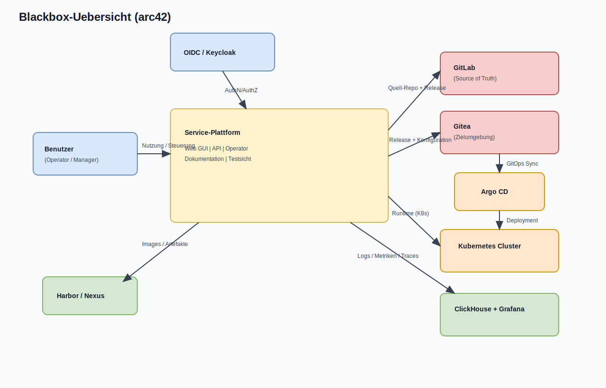

# arc42 Kapitel 3: Kontextabgrenzung

## 3.1 Ziel

Dieses Kapitel beschreibt die Systemgrenze des Services und die Beziehungen zu
externen Rollen und Umsystemen. Es liefert die Blackbox-Sicht fuer Fachseite,
Betrieb, Security und Management.

## 3.2 Blackbox-Uebersicht (draw.io)

Quelle (editierbar):
- `docs/arc42/diagrams/blackbox-overview.drawio`

## 3.3 Systemgrenze

### Innerhalb der Systemgrenze

- Web GUI (Operator-/Manager-Sichten)
- REST API fuer Konfiguration, Status und Betriebsfunktionen
- Dokumentations- und Nachweiskomponenten
- Test- und Validierungsfunktionen inkl. Test Operator
- Release-, Export- und Offline-Vorbereitung

### Ausserhalb der Systemgrenze

- OIDC-/Keycloak-Identity Provider
- GitLab (Primar-Repository / CI)
- Gitea (Zielumgebung, getrennte Projekte fuer Release/Konfig)
- Argo CD und Ziel-Kubernetes-Cluster
- Registry (Harbor/Nexus)
- zentrale Observability Backends (ClickHouse/Grafana)

## 3.4 Externe Akteure und Systeme

| Externes Element | Beziehung | Hauptzweck | Schnittstelle |
|---|---|---|---|
| Benutzer (Operator/Manager) | interaktiv | Bedienung, Freigabe, Uebersicht | Browser -> Web GUI |
| OIDC / Keycloak | Sicherheitsdienst | Authentifizierung und Rollenmapping | OIDC/OAuth2 Flows |
| GitLab (Source of Truth) | Entwicklungs- und Releasequelle | Code, Pipeline, Releases | Git/CI |
| Gitea (Zielumgebung) | Offline-Ziel-Repo | Importierte Releases und Konfig | Git |
| Argo CD | Deploy-Orchestrierung | App-of-Apps Synchronisation | GitOps Pull |
| Kubernetes Cluster | Runtime-Plattform | Betrieb von GUI/API/Operator | K8s API |
| Harbor / Nexus | Artefaktablage | OCI Images, Helm OCI | OCI Registry API |
| ClickHouse + Grafana | Observability | Speicherung und Visualisierung | OTel Export / Query |

## 3.5 Kontextschnittstellen (technisch)

| Richtung | Interface | Protokoll | Bemerkung |
|---|---|---|---|
| Benutzer -> Service | GUI/API Nutzung | HTTPS | lokal/offline erreichbar |
| Service -> OIDC | Login und Tokenvalidierung | OIDC/OAuth2/JWT | je nach Modus local/oidc/hybrid |
| Service -> Telemetrie | Logs/Metriken/Traces | OTLP/HTTP | Modus local oder clickhouse |
| GitLab -> Build/Release | SCM + Pipeline | Git + CI | Primarquelle fuer Artefakte |
| Release -> Gitea | Offline-Import | Git + Transferpaket | per Zarf/USB moeglich |
| Gitea -> Argo CD | GitOps Sync | Git | deklarative Installation |
| Argo CD -> Kubernetes | Deployment | Kubernetes API | App-of-Apps |

## 3.6 Vertrauenszonen und Sicherheitsgrenzen

| Zone | Inhalt | Vertrauensniveau | Schutzmassnahmen |
|---|---|---|---|
| Z-ACTOR | Benutzerzugriffe | variabel | AuthN/AuthZ, Session-Policies |
| Z-APP | GUI/API/Operator Pods | hoch | RBAC, PodSecurity, mTLS |
| Z-OBS | OTel/ClickHouse/Grafana | mittel-hoch | Netzsegmentierung, Zugriffspolicies |
| Z-SCM | GitLab/Gitea/Registry | hoch | signierte Releases, Audit Trails |
| Z-DEPLOY | Argo CD + Cluster API | hoch | least privilege, Policy Gate |

## 3.7 Kontextgrenzen fuer Scope-Entscheidungen

Folgende Punkte sind absichtlich nicht Teil dieses Services:

- kein Full-Managed DNS Resolver/Authoritative Betrieb
- kein externer SaaS-abhaengiger Runtime-Pfad
- keine Primardokumentation ausserhalb des Git-Repos

## 3.8 Pflege-Trigger

Dieses Kapitel muss angepasst werden bei:

- neuen externen Umsystemen
- geaenderten Schnittstellen (Protokoll, Auth, Datenfluss)
- geaenderten Sicherheitszonen oder Betriebsgrenzen

## 3.9 Verbindliche Quellen

- `docs/SVC.md`
- `features/OBJ-3-rest-api.md`
- `features/OBJ-12-security-authentifizierung.md`
- `features/OBJ-20-zielumgebung-import-rehydrierung.md`
- `features/OBJ-21-gitops-argocd.md`
- `docs/arc42/diagrams/blackbox-overview.drawio`
