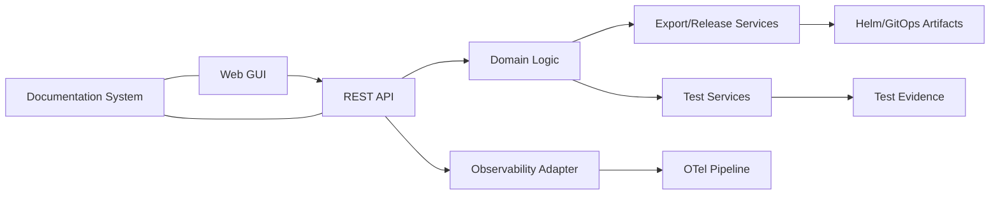

# arc42 Kapitel 5: Bausteinsicht

## 5.1 Ziel

Dieses Kapitel beschreibt die innere Struktur der Loesung in logischen
Bausteinen. Es verbindet Fachsicht, technische Module und Betriebsbausteine.

## 5.2 Level 1: Hauptbausteine

## 5.3 Level 2: Fachlich-technische Bausteine

| Baustein | Verantwortung | Wichtige Pfade |
|---|---|---|
| UI Shell | Navigation, Seitenstruktur, Rollenfuehrung | `src/app/**`, `src/components/**` |
| Configuration UI | Participant-Konfiguration und Validierung | `src/app/participant-config` |
| Zone Generator UI/API | BIND9 Zone-Generierung | `src/app/zone-generator`, `/api/v1/zones/generate` |
| Traceability UI/API | Requirement/Test-Abdeckung | `src/app/requirements-traceability` |
| Test Runner + Execution Dashboard | manuelle/automatische Testsicht | `src/app/test-runner`, `src/app/test-execution-dashboard` |
| Baseline & History Services | baseline laden, Aenderungen, Rollback | `/api/v1/baseline`, `/api/v1/history` |
| Security & Auth | lokale/OIDC Auth + RBAC | `/api/v1/auth/*`, `src/lib/obj12-auth.ts` |
| Observability Adapter | OTel Events/Logs/Metriken/Traces | `src/lib/obj11-observability.ts` |
| Release/Gate Services | Release-Metadaten, Artefakt-Gates | `/api/v1/releases`, `/api/v1/gate` |
| Deployment View Services | Helm/GitOps/Target-Import Status | `/api/v1/helm/status`, `/api/v1/gitops`, `/api/v1/target-import` |

## 5.4 Level 2: Plattform- und Betriebsbausteine

| Baustein | Verantwortung | Pfad |
|---|---|---|
| Helm Chart | standardisierte Installation, Profile, Validierung | `helm/dns-management-service/` |
| K8s Base Manifeste | Basiskonfiguration fuer Cluster-Runtime | `k8s/base/**` |
| Test Operator (Go) | zeitgesteuerte Testausfuehrung, OTel Reporting | `cmd/test-operator/**`, `internal/**` |
| CI/CD Workflow | Build-, Test-, Gate- und Publish-Automation | `.github/workflows/**` |
| Security Artifact Pipeline | SBOM-/Scan-Bundles | `docs/security/**`, `docs/releases/**` |

## 5.5 Level 3: Daten- und Artefaktbausteine

| Artefaktklasse | Beispiele | Nutzung |
|---|---|---|
| Feature-Spezifikationen | `features/OBJ-*.md` | Scope, ACs, QA und Freigabestatus |
| Capability-/Requirement-Struktur | `capabilities/**` | fachliche Referenz und Traceability |
| Testnachweise | `tests/executions/**`, `docs/testing/**` | auditable Testbelege |
| ADRs | `docs/adr/**` | Architekturentscheidungen |
| arc42 | `docs/arc42/**` | Architekturgesamtsicht |
| Export-/Release-Log | `docs/exports/**`, `docs/releases/**` | Nachweis fuer Release und Copy-Jobs |

## 5.6 Wichtige interne Schnittstellen

| Schnittstelle | Zweck |
|---|---|
| `/api/v1/openapi.json` | maschinenlesbare API-Dokumentation |
| `/api/v1/swagger` | menschenlesbare API-Hilfe |
| `/api/v1/auth/*` | Login, Session, Logout |
| `/api/test-execution-dashboard` | konsolidierte Teststatusdaten |
| `/api/v1/telemetry` | Observability-Status/Signale |
| `/api/v1/operator/tests` | Test-Operator-Laufdaten |

## 5.7 Modulgrenzen und Verantwortlichkeiten

| Domane | Primarverantwortung |
|---|---|
| Requirements/Scope | Feature-Specs, Capability-Mapping |
| Architektur | arc42, ADR, Strukturentscheidungen |
| Frontend | UI-Sichten, Statusdarstellung, Bedienbarkeit |
| Backend | API, Validierung, Sicherheitslogik |
| QA | Testdurchfuehrung, Findings, Nachweise |
| Deploy/Platform | Helm/K8s/GitOps/Offline-Pfad |

## 5.8 Erweiterungspunkte

- neue API-Objekte werden als eigenes `OBJ-*` inkl. AC/QA/Doku eingefuehrt
- neue Plattformfaehigkeiten (z. B. weitere Storage-Backends) folgen gleicher DoD-Regel
- neue Security- oder Policy-Funktionen werden in `security-baseline` und Kapitel 8 gespiegelt

## 5.9 Pflege-Trigger

Kapitel 5 wird aktualisiert bei:

- neuen Kernmodulen oder API-Domaenen
- Umstrukturierung in `src/`, `helm/`, `k8s/` oder Operator-Code
- neuen verbindlichen Artefaktklassen

## 5.10 Verbindliche Quellen

- `src/`
- `features/OBJ-3-rest-api.md`
- `features/OBJ-9-manual-test-runner.md`
- `features/OBJ-25-helm-charts.md`
- `features/OBJ-26-test-operator-scheduled-execution.md`
- `capabilities/INDEX.md`
