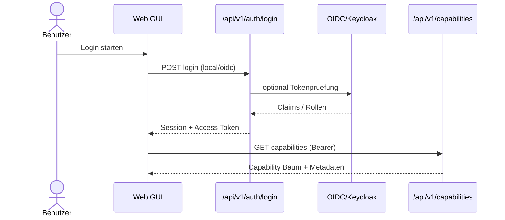
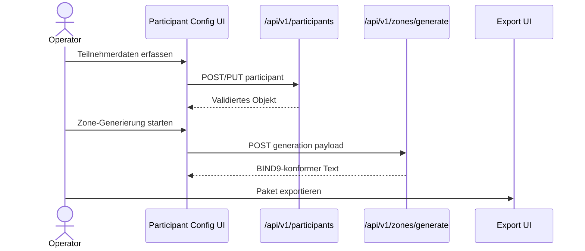
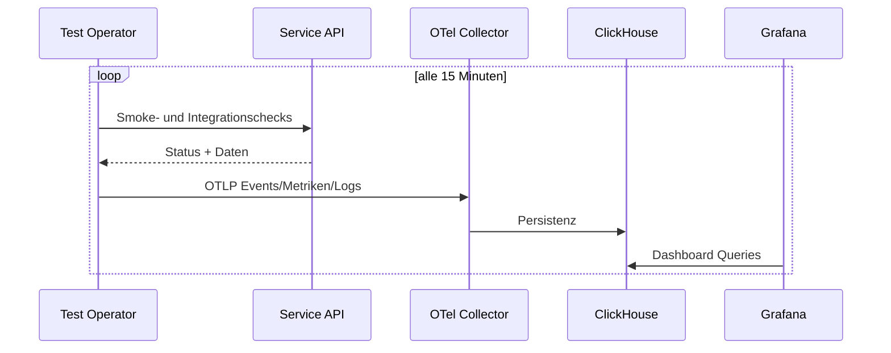

# arc42 Kapitel 6: Laufzeitsicht

## 6.1 Ziel

Dieses Kapitel beschreibt die wichtigsten Laufzeitablaeufe mit Fokus auf
Anwenderfluss, Betriebsfluss, Releasefluss und Nachweisfluss.

## 6.2 Szenario R-01: Login und Zugriff auf Capabilities

Ergebnis:

- Rolle ist gesetzt (viewer/operator/admin)
- Zugriff auf geschuetzte Sichten ist aktiviert

## 6.3 Szenario R-02: Participant-Konfiguration bis Zone-File

Ergebnis:

- konsistente Konfiguration
- generierte Forward/Reverse Zone-Files
- exportierbares Paket fuer Zielbetrieb

## 6.4 Szenario R-03: Test Operator Intervalllauf (15 Minuten)

Ergebnis:

- periodische Testnachweise ohne manuelles Triggern
- konsolidierbare QA-/Release-Sicht

## 6.5 Szenario R-04: Release bis Offline-Import

1. Feature ist in Git inkl. Doku, Tests, QA und DoD-Nachweis abgeschlossen.
2. Releaseversion wird im Format `YYYY.MM.N` gesetzt.
3. Build, Security-Scans, Artefakt-Gates und Validation Matrix laufen.
4. Artefakte werden als OCI/Helm/Zarf vorbereitet.
5. Transfer in Zielumgebung (z. B. USB) wird protokolliert.
6. Import nach Gitea und Deployment ueber Argo CD App-of-Apps.
7. Export-Protokoll und Release-Notizen werden nachgezogen.

Ergebnis:

- reproduzierbarer, auditable Lieferpfad von Quelle bis Zielcluster

## 6.6 Szenario R-05: Baseline laden, Aenderung protokollieren, Rollback

1. Baseline-Konfiguration wird aus separatem Git-Repository geladen.
2. Aenderung erzeugt nachvollziehbaren History-Eintrag.
3. Unterschiede sind in Verlauf/Detail einsehbar.
4. Bei Bedarf wird gezielter Rollback auf definierten Stand ausgefuehrt.
5. Test-/Nachweisstatus wird aktualisiert.

Ergebnis:

- jeder DNS-relevante Eingriff ist nachvollziehbar und rueckgaengig machbar

## 6.7 Fehlerszenarien und erwartetes Verhalten

| Fehlerfall | Erwartetes Verhalten |
|---|---|
| OIDC nicht erreichbar | lokaler Hinweis, definierter Fallback oder klarer Blocker |
| OTel Endpoint nicht erreichbar | lokales Spooling, kein stiller Datenverlust |
| Policy-Verstoss beim Deployment | Deployment wird blockiert, Befund wird sichtbar |
| Export ohne Vollstaendigkeit | Gate verhindert Freigabe |
| Statuskonflikt in Doku | Status-Sync-Check faellt rot aus |

## 6.8 Pflege-Trigger

Kapitel 6 wird aktualisiert bei:

- neuen Kernablaeufen (z. B. neuer Operator-Loop, neuer Importpfad)
- geaenderten Freigabe-/Exportregeln
- geaenderten Fehlerbehandlungsstrategien

## 6.9 Verbindliche Quellen

- `docs/QUICK-GUIDE-FEATURE-UND-REQUIREMENT.md`
- `docs/CONFLUENCE-EXPORT-GUIDE.md`
- `features/OBJ-14-release-management.md`
- `features/OBJ-19-zarf-paket-offline-weitergabe.md`
- `features/OBJ-24-dns-baseline-config-repository.md`
- `features/OBJ-26-test-operator-scheduled-execution.md`
