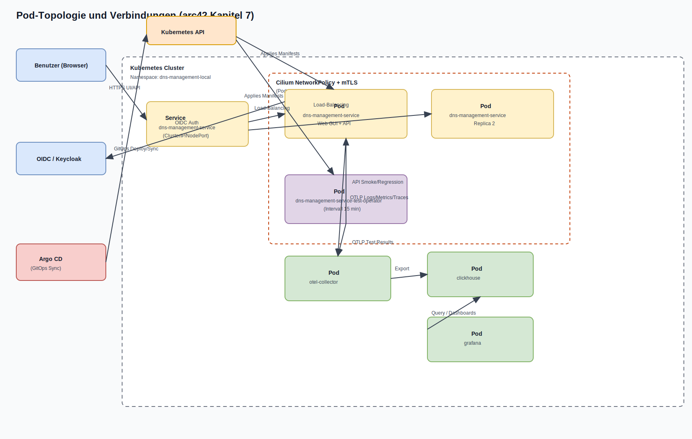

# arc42 Kapitel 7: Verteilungssicht

## 7.1 Ziel

Dieses Kapitel beschreibt, wie die Loesung physisch und logisch verteilt wird:
von lokaler Entwicklung bis zur on-prem Zielumgebung inklusive GitOps,
Registry- und Offline-Transferpfad.

## 7.2 Zieltopologie

- Primarziel: on-prem Kubernetes Cluster
- lokale Test-/Integrationsumgebung: Docker Desktop Kubernetes
- deklarative Auslieferung: Helm + GitOps (Argo CD App-of-Apps)
- Artefaktfluss: OCI Registry + Zarf Offline-Paket

## 7.3 Pod-Topologie und Verbindungen (draw.io)

Quelle (editierbar):
- `docs/arc42/diagrams/pod-connectivity.drawio`

Wichtige Verbindungen:

- Benutzer -> `dns-management-service` (HTTPS UI/API)
- Service -> App-Pods (Load-Balancing auf Replikas)
- App-Pod -> OIDC/Keycloak (Authentifizierung)
- Test-Operator -> App-Pod (Intervall-Tests alle 15 Minuten)
- App-Pod und Test-Operator -> OTel Collector (OTLP)
- OTel Collector -> ClickHouse (Persistenz)
- Grafana -> ClickHouse (Dashboard-Abfragen)
- Pod-zu-Pod innerhalb des Runtime-Bereichs via Cilium Policy + mTLS

## 7.4 Deployment-Umgebungen

| Umgebung | Zweck | Besonderheiten |
|---|---|---|
| Local | Entwickler- und Smoke-Tests | Docker Desktop K8s, reduzierte externe Abhaengigkeit |
| Internal | Integrations- und Vorabfreigabe | strengere Policies, release-nahe Konfiguration |
| Production | Zielbetrieb on-prem | volle Security-/Compliance-Policies, kein Debug |

## 7.5 Deployment-Einheiten

| Einheit | Typ | Quelle |
|---|---|---|
| `dns-management-service` | OCI Image | Build Pipeline |
| `dns-management-service-test-operator` | OCI Image | Build Pipeline (Go Operator) |
| Helm Chart `dns-management-service` | OCI Chart | `helm/dns-management-service` |
| Zarf Paket | Offline Bundle | Release Pipeline |
| Gitea Release Repo | Git | importierte Runtime-Artefakte |
| Gitea Config Repo | Git | parameterisierte Zielkonfiguration |

## 7.6 Helm-Deploymentfluss (OBJ-25)

1. Chart lokal validieren (`helm lint`, `helm template`) fuer alle Profile.
2. Sicherheits- und Konsistenzregeln im Chart validieren (`values.schema.json`, Guard Templates).
3. Deployment/Upgrade via `helm upgrade --install`.
4. Rollback via `helm history` und `helm rollback`.
5. Chart als OCI-Artefakt veroeffentlichen (`helm package`, `helm push`).
6. Deploymentstatus in API/UI sichtbar machen (`/api/v1/helm/status`, `/helm`).

## 7.7 GitOps- und Offline-Pfad

1. Quellrepo in GitLab wird gebaut, geprueft und versioniert.
2. Artefakte (Images, Charts, Pakete) werden in Registry/Release-Struktur abgelegt.
3. Zarf-Bundle wird in Zielnetz transferiert.
4. Import nach Gitea (separates Runtime- und Config-Projekt).
5. Argo CD synchronisiert App-of-Apps in Zielcluster.

## 7.8 Netzwerk- und Sicherheitsverteilung

| Bereich | Mechanismus |
|---|---|
| Ingress/Egress | Cilium-Regeln fuer ein- und ausgehenden Verkehr |
| Pod-zu-Pod | mTLS + explizite Network Policies |
| Policy Control | OPA-Checks fuer Labels/Deploy-Regeln |
| Runtime Monitoring | Tetragon/Hubble Signale in Observability-Pfad |
| Pod Security | restricted PodSecurity + seccomp RuntimeDefault |

## 7.9 Konfigurations- und Secret-Verteilung

| Typ | Primarpfad | Alternative |
|---|---|---|
| Runtime Konfig | Helm Values / ConfigMaps | profile-spezifische Values |
| Secrets | OpenBao Service | lokaler fallback (geringere Sicherheit, klar markiert) |
| Zertifikate | Cluster-/PKI-Prozess | dokumentierter manueller Pfad fuer Airgap |

## 7.10 Storage-Varianten

| Bedarf | Option |
|---|---|
| lokal/persistente Dateien | File/PVC |
| objektbasiert | S3-kompatibler Speicher |
| block/file/object in Cluster | Rook-Ceph (wenn vorhanden) |

## 7.11 Betriebscheckliste (vor Freigabe)

- Helm Lint/Template erfolgreich fuer Zielprofil
- OCI-Images und Chart veroeffentlicht und referenzierbar
- Security-Policies und PodSecurity ohne Blocker
- Observability-Exportpfad lokal oder zentral nachgewiesen
- Export-/Import-Nachweis im Release dokumentiert

## 7.12 Pflege-Trigger

Kapitel 7 wird angepasst bei:

- neuen Deployment-Profilen oder Cluster-Topologien
- geaenderten GitOps-/Offline-Pfaden
- neuen Security-/Netzwerkregeln im Betrieb
- Aenderungen der Storage- oder Secret-Strategie

## 7.13 Verbindliche Quellen

- `features/OBJ-10-kubernetes-deployment.md`
- `features/OBJ-25-helm-charts.md`
- `features/OBJ-18-artefakt-registry.md`
- `features/OBJ-19-zarf-paket-offline-weitergabe.md`
- `features/OBJ-20-zielumgebung-import-rehydrierung.md`
- `features/OBJ-21-gitops-argocd.md`
- `req-init/security-baseline.md`
